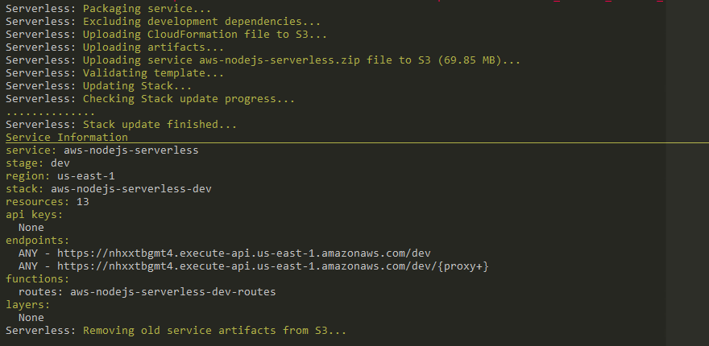
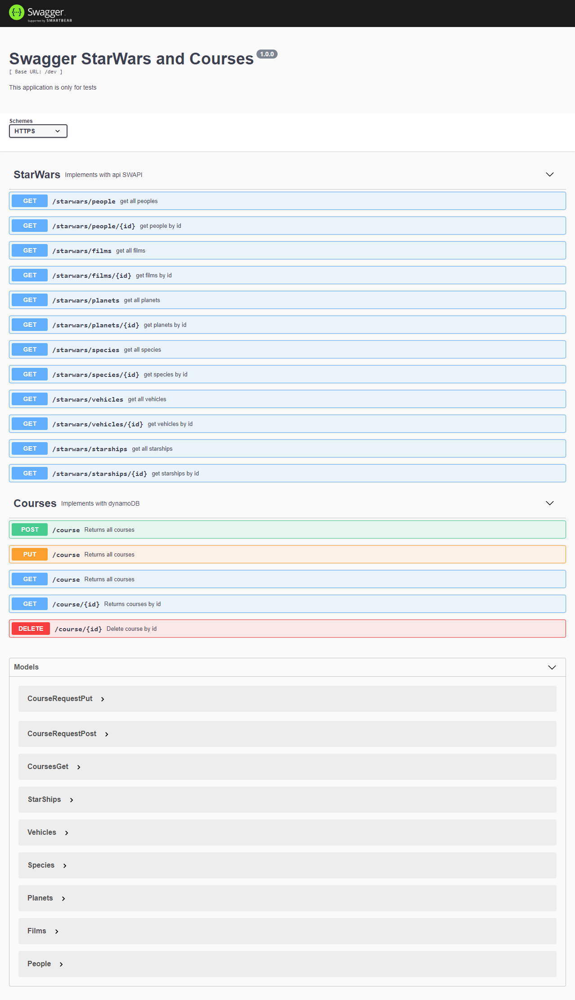
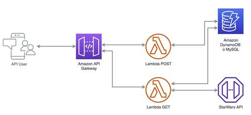

# Integration SWAPI and dynamodb

> At present this project is running on: https://nhxxtbgmt4.execute-api.us-east-1.amazonaws.com/dev

Steps for install:
1. run `npm install`
2. config your credential of aws
3. run `sls deploy`

For exec unit test: `npm run test`

the endpoints this repository are bellow: `/dev/api-docs`

For this project has the architect bellow:

